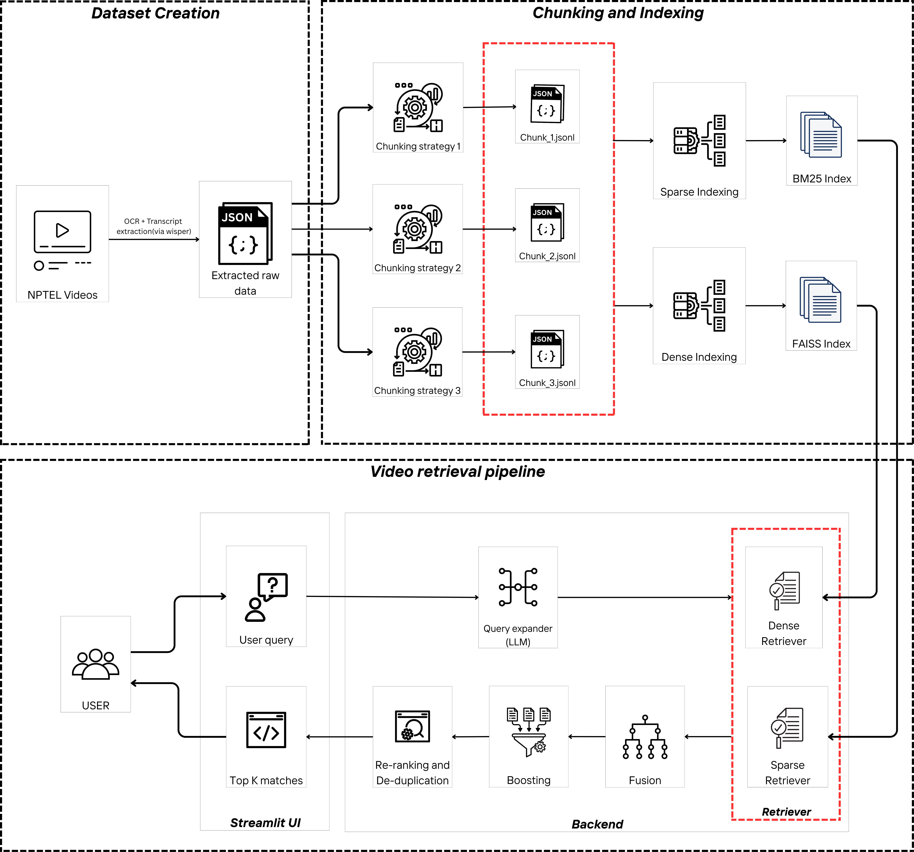
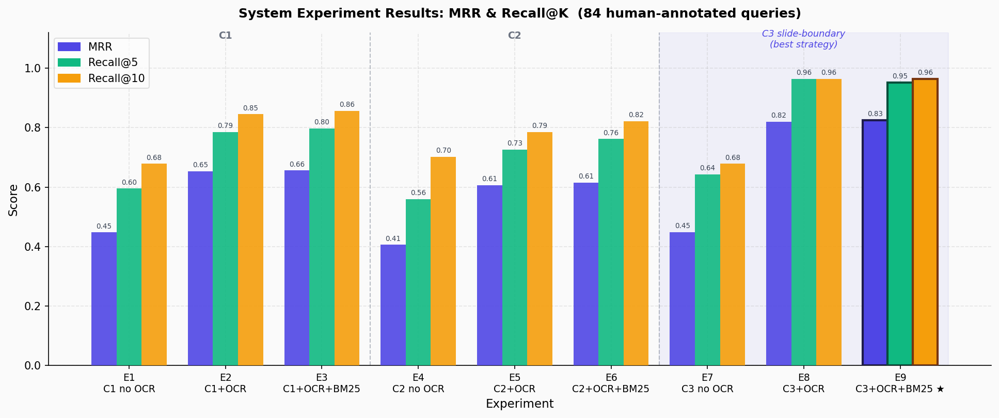
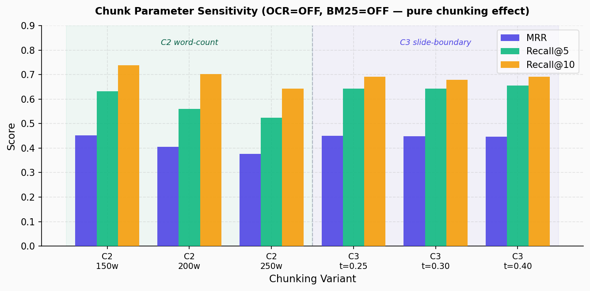

# VidyaRAG — Multimodal Hybrid Lecture Retrieval

> **Multimodal NPTEL Lecture Retrieval with Hybrid RAG** | *BGE-large + BM25 + RRF + Cross-encoder Reranking*

[](https://github.com/Sourav-Nath-01/vidyarag)
[](https://huggingface.co/spaces/SouravNath/vidyarag)
[](LICENSE)

An AI-powered semantic search system over NPTEL lecture transcripts and OCR slide content. Achieves **MRR 0.826 / Recall@10 0.964** across 9 CS courses and 24,000+ indexed segments.

---

## System Architecture

<p align="center">
  
</p>

---

## Key Results

| Configuration | MRR | Recall@5 | Recall@10 |
|---|---|---|---|
| C1 transcript only (baseline) | 0.4478 | 0.5952 | 0.6786 |
| C2 + OCR + BM25 | 0.6148 | 0.7619 | 0.8214 |
| **C3 + OCR + BM25 (Full System)** | **0.8259** | **0.9524** | **0.9643** |

Evaluated on **84 human-annotated queries** across 9 NPTEL courses (DSA, DAA, Deep Learning, OS, DBMS, CV, COA, ML, CN).

<p align="center">
  
</p>

---

## Features

- **Semantic lecture retrieval** using BGE-large-en-v1.5 dense embeddings (FAISS)
- **OCR-enhanced multimodal search** — Whisper ASR transcripts fused with Tesseract slide text
- **Novel C3 slide-boundary chunking** via OCR Jaccard similarity (83% MRR improvement over fixed-window baseline)
- **Hybrid retrieval** — FAISS dense + BM25 sparse, fused via Reciprocal Rank Fusion
- **Cross-encoder reranking** (ms-marco-MiniLM-L-6-v2)
- **LLM query analysis** — intent classification + query expansion via local Ollama
- **LLM-as-judge evaluation** — automated relevance scoring via Llama 3.2
- **REST API** — FastAPI `/search` endpoint for production use
- **Streamlit UI** — course filter, YouTube deep-links, query history
- **Full ablation study** — 9 system experiments + chunk parameter sensitivity

---

## Tech Stack

| Layer | Tools |
|---|---|
| Embeddings | `BAAI/bge-large-en-v1.5`, Sentence Transformers |
| Vector Search | FAISS (IndexFlatIP, cosine similarity) |
| Sparse Retrieval | BM25 (rank-bm25) |
| Reranking | `cross-encoder/ms-marco-MiniLM-L-6-v2` |
| ASR | Whisper (OpenAI) |
| OCR | Tesseract + pytesseract |
| LLM | Ollama (Llama 3.2:3b) |
| API | FastAPI + Uvicorn |
| UI | Streamlit |
| Evaluation | MRR, Recall@K, LLM-judge |

---

## Project Structure

```bash
nptel-lecture-retrieval/
│
├── data/                       # Dataset and processed retrieval chunks
│   ├── raw/                    # Raw Whisper transcripts + OCR output
│   ├── processed/              # Chunked segments (segments_c1/c2/c3.jsonl)
│   ├── indexes/                # FAISS + BM25 index files
│   └── eval/                   # Evaluation queries and metrics
│
├── src/
│   ├── data_collection/        # ASR transcription, OCR, metadata builder
│   │   ├── 1_metadata_builder.py
│   │   ├── 2_chunker_c1.py     # Fixed 30s window chunking
│   │   ├── 2_chunker_c2.py     # Utterance / word-count chunking
│   │   ├── 2_chunker_c3.py     # Slide-boundary chunking (novel, OCR Jaccard)
│   │   └── segment_utils.py
│   └── retrieval/
│       ├── embedder.py         # BGE-large FAISS index builder
│       ├── bm25_builder.py     # BM25 index builder
│       ├── retriever.py        # Full retrieval pipeline
│       └── evaluator.py        # Ablation study + metrics
│
├── api/                        # FastAPI REST server
│   └── app.py
│
├── tests/                      # Unit test suite (pytest)
│   └── test_core.py
│
├── configs/
│   ├── courses.json
│   └── Readme.md
│
├── img/                        # Architecture diagrams
├── app.py                      # Streamlit UI (main entry point)
├── eval_app.py                 # Annotation / evaluation Streamlit UI
├── requirements.txt
└── env.example
```

---

## Installation

Clone the repository:

```bash
git clone https://github.com/Sourav-Nath-01/vidyarag.git
cd vidyarag
```

Create and activate a virtual environment:

```bash
python -m venv venv
source venv/bin/activate          # Linux / macOS
# venv\Scripts\activate           # Windows
```

Install dependencies:

```bash
pip install -r requirements.txt
```

Copy and configure environment variables:

```bash
cp env.example .env
# Edit .env — set PROJECT_ROOT, EMBEDDING_DEVICE, etc.
```

---

## Usage

### Streamlit UI (primary demo)

```bash
streamlit run app.py
# Custom port:
streamlit run app.py --server.port 8502
```

### FastAPI REST Server

```bash
uvicorn api.app:app --reload --port 8000
# Then POST to: http://localhost:8000/search
```

Example request:
```bash
curl -X POST http://localhost:8000/search \
  -H "Content-Type: application/json" \
  -d '{"query": "how does binary search tree insertion work", "strategy": "c3", "top_k": 5}'
```

### CLI retrieval

```bash
python src/retrieval/retriever.py --query "BST insertion" --strategy c3
python src/retrieval/retriever.py --query "backpropagation" --llm --verbose
```

### Quick Demo (No GPU required)

Runs the **full pipeline** (dense + BM25 + RRF + reranker) on 300 real segments using the lightweight `all-MiniLM-L6-v2` model. Completes in ~2 minutes on any CPU.

```bash
python quick_demo.py
```

Demo indexes are pre-built in `data/indexes/` — no rebuild needed.

### Annotation / Evaluation UI

Interactive Streamlit tool used to create and validate the 84-query human-annotated evaluation set with timestamp grounding.

```bash
streamlit run eval_app.py
```

---

## Retrieval Pipeline

```
Query
  ↓
[Optional] LLM query analysis (intent + expansion)   ← Ollama
  ↓
BGE-large query embedding                            ← dense
  ↓
FAISS top-100 candidates                             ← dense
  ↓
BM25 top-100 candidates                              ← sparse
  ↓
Reciprocal Rank Fusion (RRF)                         ← fusion
  ↓
Content-type score boost (code/theory/conceptual)
  ↓
Cross-encoder reranking (ms-marco-MiniLM)            ← rerank
  ↓
Lecture-level deduplication
  ↓
Top-K results with YouTube deep-links
```

---

## Chunking Strategies

| Strategy | Description | Novel? |
|---|---|---|
| C1 | Fixed 30-second chunks — simple baseline | No |
| C2 | Word-count boundaries (≈200 words), respects sentence structure | No |
| **C3** | **Slide-boundary detection via OCR Jaccard similarity** — boundaries placed where consecutive slide OCR overlap drops below threshold | **Yes** |

**C3 algorithm detail:**
```
For consecutive segments (N, N+1):
  sim = |words(OCR_N) ∩ words(OCR_N+1)| / |words(OCR_N) ∪ words(OCR_N+1)|
  if sim < threshold → new chunk boundary (slide changed)
Fallback: word-count boundary when OCR confidence is low
Min/max duration rules applied after initial segmentation
```

---

## Evaluation

### GROUP 1 — System Experiments (9 configs)

| Exp | Strategy | OCR | BM25 | MRR | Recall@5 | Recall@10 |
|---|---|---|---|---|---|---|
| E1 | C1 | ❌ | ❌ | 0.4478 | 0.5952 | 0.6786 |
| E2 | C1 | ✅ | ❌ | 0.6536 | 0.7857 | 0.8452 |
| E3 | C1 | ✅ | ✅ | 0.6564 | 0.7976 | 0.8571 |
| E4 | C2 | ❌ | ❌ | 0.4059 | 0.5595 | 0.7024 |
| E5 | C2 | ✅ | ❌ | 0.6066 | 0.7262 | 0.7857 |
| E6 | C2 | ✅ | ✅ | 0.6148 | 0.7619 | 0.8214 |
| E7 | C3 | ❌ | ❌ | 0.4487 | 0.6429 | 0.6786 |
| E8 | C3 | ✅ | ❌ | 0.8200 | 0.9643 | 0.9643 |
| **E9** | **C3** | **✅** | **✅** | **0.8259** | **0.9524** | **0.9643** |

Evaluation set: **84 human-annotated queries**, timestamp-grounded (90s tolerance window).

### GROUP 2 — Chunk Parameter Sensitivity

| Variant | MRR | Recall@5 | Recall@10 |
|---|---|---|---|
| C2 (150w) | 0.4527 | 0.6310 | 0.7381 |
| C2 (200w) | 0.4059 | 0.5595 | 0.7024 |
| C2 (250w) | 0.3762 | 0.5238 | 0.6429 |
| C3 (t=0.25) | 0.4494 | 0.6429 | 0.6905 |
| C3 (t=0.30) | 0.4487 | 0.6429 | 0.6786 |
| C3 (t=0.40) | 0.4467 | 0.6548 | 0.6905 |

<p align="center">
  
</p>

### Running the evaluation

```bash
python src/retrieval/evaluator.py               # all experiments
python src/retrieval/evaluator.py --experiment E9
python src/retrieval/evaluator.py --group1-only
python src/retrieval/evaluator.py --no-llm-judge
```

### Running tests

```bash
pytest tests/ -v
```

---

## Dataset Statistics

| Variant | Segments | Avg Duration | Avg Words | OCR Fail% |
|---|---|---|---|---|
| C1 (30s) | 24,804 | 33.2s | 80.6 | 3.4% |
| C2 (200w) | 9,841 | 85.3s | 203.1 | 1.9% |
| C3 (t=0.30) | ~15,000 | ~54s | ~131 | ~1.8% |

---

## Future Improvements

- Fine-tune bi-encoder on query-segment pairs (contrastive learning)
- ColBERT late-interaction reranking
- Multilingual retrieval (Hindi NPTEL lectures)
- Slide image embeddings (CLIP-based)
- Voice-based query support
- Adaptive chunk merging

---

## Contributing

Contributions are welcome through pull requests and issue discussions.

---

## License

This project is licensed under the MIT License.
